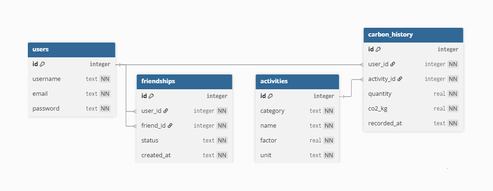

# TerraGauge : 

## 1. Présentation : 

### Naissance de l'idée : 

Quand on a réfléchi autour du thème de l'année, on s’est rendu compte que le plus grand lien entre la nature et l'informatique, 
c'est l'impact désastreux que l'informatique a sur l'écologie.
Nous avons donc décidé de nous pencher un peu plus dessus en élargissant le sujet autour de l'empreinte carbone.
Il nous est ainsi parru plus sensé de créer une application qui pourrait rendre cela visuel et concret.

### Problématique : 
Le premier gros problème auquel nous avons été confronté au début du projet, c'est le choix d'une bibliothèque Python pertinente qui nous permettrait de mener à bien notre application. 

### Objectifs : 
- Ajouter des actions auxquelles on peut estimer l'impact écologique associé. 
- Pouvoir afficher un bilan sur les 7 derniers jours
- Avoir un classement avec un système d'amis
- Avoir un rendu graphique compatible sur mobile. 

## 2. Organisation du travail :

### Membres : 
- Léo Diotallevi
- Patrick Addison
- Maël Yvetot

### Rôle de chacun et répartition des tâches : 

Concernant la partie code, on peut considérer que nous avons tous les 3 contribué aux différents aspects du projet. Même si pour chacun de nous, il existe un élément "propre" que chacun a créé principalement : 
- Le système d'amis, la rédaction des différents éléments et les requêtes SQL pour Léo 
- Le système de classement et la configuration de la BDD Turso pour Patrick
- La page de profil, les couleurs et les différents aspects graphiques pour Maël
- Le menu d'ajout d'action pour Maël et Patrick. 

### Temps passé sur le projet et éléments notables : 
Nous avons passé un temps conséquent sur ce projet. Il est cependant possible de relever quelques éléments pertinents autour de la tâche de travail en question : 
- La tâche la plus complexe à réaliser et à mettre en place tourne autour de l'aspect graphique de l'application. En effet, malgré le peu d'éléments graphiques sur l'application, il s'agit d'une tâche conséquente de réaliser une interface agréable à regarder avec un style assez moderne. Ainsi, nous avons tous les 3 passé un temps important à lire la documentation de Kivy et KivyMD ainsi qu'à regarder de nombreux tutoriels pour maîtriser la librairie Python. À noter que pour l'utiliser, nous avions 2 choix : 
- Soit nous ne restions que sur du Python déclaratif pur, dans ce cas-là le code aurait été véritablement compliqué.
- Soit nous choisissions d'introduire le kvlang, un langage syntaxique propre à Kivy et KivyMD qui permet de séparer la partie graphique de la partie logique (Python) et d'organiser facilement l'interface.

Même si le règlement demandait d'utiliser exclusivement des langages du programme, on a fait ce choix car sinon, nous nous serions retrouvés face à un code très peu compréhensible et très complexe à manipuler. Au-delà de l'introduction de ce langage syntaxique, nous estimons que nous avons principalement suivi le programme de NSI notamment avec : le langage SQL, le Python, la POO (malgré une légère dérive avec la notion d'héritage (qui a quand même été rapidement vu en classe avec notre professeure)).

Pour gérer le code en lui-même et les versions, nous nous sommes organisés de plusieurs manières en fonction de la situation :
Quand nous devions coder et que chacun voulait avancer sur sa partie, nous avons utilisé l'éditeur de code VS Code avec l'extension LiveShare qui nous permettait à tous les 3 d'avancer clairement chacun sur le projet sans impacter le travail des autres.
Pour le versioning et la gestion des différents fichiers, nous avons utilisé GitHub et Git. En l'occurrence, cela nous a clairement permis d'apprendre à maîtriser les commandes Git. En effet, nous étions plus habitués à l'interface graphique de Git (ou bien celle intégrée directement dans VS Code). Cependant, comme nous devions coder sur les ordinateurs de notre lycée, et que l'installation de n'importe quelle application nécessitait les droits admin, nous nous sommes retrouvés à devoir utiliser une version portable du logiciel Git qui tournait sous forme de ligne de commande (au même titre que notre installation de VS Code correspondait à la version portable pour clé USB disponible en ligne (installable sans droit admin)).

## Étapes du projet : 

- Modélisation et brainstorming sur ce que nous allons faire concrètement dans le projet.
- Création de l'application de base en elle-même avec le main screen et les onglets en bas (même vides)
- Mise en place d'une première base de données SQLite locale avec la première table users
- Mise en place du menu d'authentification 
- Ajout de la sécurité des mots de passe avec bcrypt
- Ajout de la table friendships
- Ajout du système d'amis avec les demandes et la liste des différents amis
- Ajout des tables activités et carbon_history
- Mise en place du menu pour ajouter une grande liste d'activités, à noter qu'au début, hypothétiquement, nous voulons récupérer une liste d'activité directement grâce à une API pour avoir une plus grande variété d'action à enregistrer mais on s'est rendu compte de la tâche conséquente que cela représentait, nous avons donc décidé de ne pas le faire et de récupérer manuellement une liste d'éléments trouvés sur le web.
- Ajout du système de leaderboard (au début seulement empreinte carbone totale sans la notion de durée)
- Ajout de la page d'accueil avec un message custom par rapport à la moyenne française hebdomadaire
- Ajout d'une option pour choisir l'intervalle sur lequel se base le leaderboard pour afficher ses données.
- Optimisations

## 4. Opérationnalité du projet : 

### État d'avancement : 
A la fin du projet, l'application est fonctionnelle, malgré un certain petit manque de contenu par rapport aux modélisations initiales, nous considèrons que nous avons quand même réussi à réaliser un beau projet.

### Vérification : 
Nous avons fait face à pas mal de bugs ou de cas pas forcément désirés, pour le coup, une action personnelle que j'ai pu utiliser (Léo qui écrit) a été de demander à ma famille de tester plusieurs aspects de l'application jusqu'à ce qu'ils trouvent des bugs à régler ou des cas de situations pas prévus (par exemple la possibilité d'envoyer des demandes d'amis même si nous sommes déjà amis etc).

### Difficultés rencontrées : 

- Le plus difficile à maîtriser et apprendre a clairement été KivyMD, c'était une bibliothèque que nous ne maîtrisions pas du tout à l'origine, la prise en main a pris beaucoup de temps- Turso / libsql : au début la connexion ne marchait pas du tout... Nous étions un peu perdus, même notre professeure ne savait pas comment faire sur le moment pour régler le souci (au final il s'agissait juste d'un problème de version, en effet, nous utilisions une alternative à libsql qui correspondait à sa version bêta et donc instable)
- Quelques problèmes d'optimisation notamment autour du cache pour l'implémenter correctement.

## 5. Ouverture : 

### Idées d'améliorations : 

- Nous aurions apprécié pouvoir implémenter un graphique
- Nous stockons les historiques de toutes les actions ajoutées dans la BDD, mais nous n'avons aucun menu pour les afficher

### Analyse : 
Le projet en lui-même répond à notre idée de base, nous sommes juste un peu sceptiques sur l'utilisation du kvlang vis-à-vis du programme de NSI.

### Compétences développées : 

- Utilisation de Kivy et KivyMD pour créer une application avec une belle interface graphique
- Utilisation d'une base de données SQLite dans un programme Python 
- Utilisation d'une base de données distante avec la gestion d'une connexion via un token
- Sécurisation des mots de passe avec le hash bcrypt
- Utilisation du logiciel Git sous forme de commandes
- Optimisation des performances
- Développement des compétences de Markdown

## Gallerie :

### BDD : 

### Structures des fichiers :
